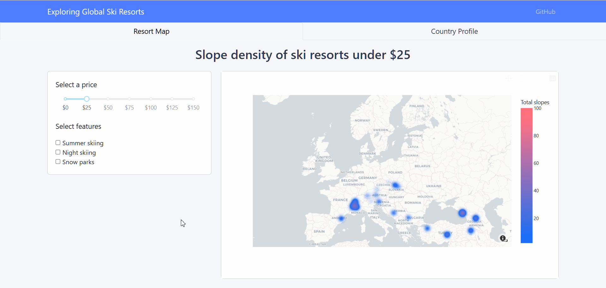

# Building a web application dashboard with Python 

A multi-tab dashboard application was built with Dash to explore global ski resort data.

## Preview

### Skills Showcase

- Dashboard development
  - html and css
- Multiple visualization tools
  -	Bar chart
  -	Density maps
- Interactive elements
  -	Dropdown menus
  -	Checkboxs
  - Tabs
  - Dynamic titles
  - Data read outs while hovering in graph
- Standard callbacks
- Chained callbacks
- Cross-filtering callbacks

## Tools used
Python
-	Pandas - For data manipulation
-	Plotly – Used for data visualization
-	Dash – Used to create dashboard web application
  
## Author
kieswetter-hub
